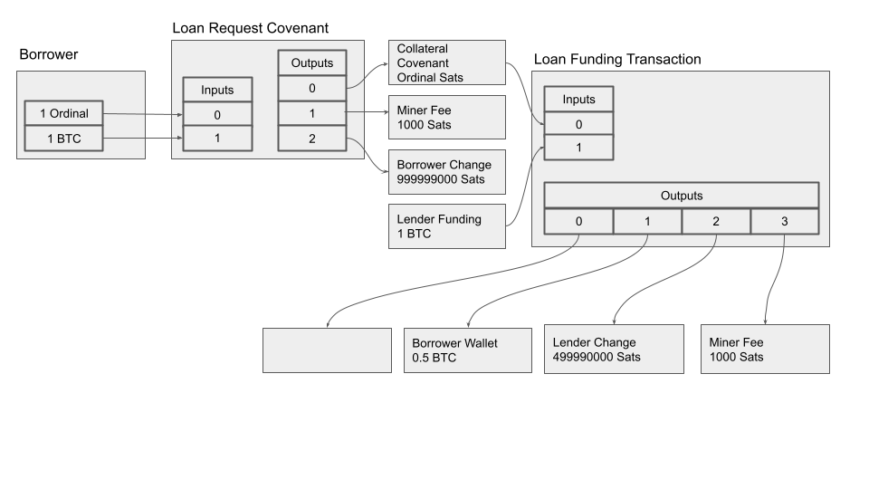

# Use Cases - Ordinal Lending

> Creating an Ordinal lending protocol using Bitcoin Discreet Log Contracts (DLC) involves designing a trust-minimized
> system that enables borrowers to access loans while maintaining the security and trustlessness of the Bitcoin
> blockchain. In this protocol,lenders and borrowers engage in DLC smart contracts, allowing borrowers to lock up Ordinal
> collateral in a multisignature address while receiving a loan in return. The terms of the loan, such as interest rates
> and repayment deadline, are be encoded in a DLC contract. Conditions are established to define the contract outcomes
> (ie repayment amount and repayment deadline date). This mechanism ensures that borrowers meet their repayment
> obligations and that lenders are appropriately compensated. By leveraging Bitcoin\'s native scripting language, as
> well as Tapscript, and the Schnorr signature scheme, this protocol would provide a novel way to create trustless
> lending agreements while minimizing the need for intermediaries.  This system offers the first secure and transparent
> solution for ordinal lending within the cryptocurrency ecosystem.

## Architecture

### Workflow

1. Borrower locks their Ordinal into a Loan Request Covenant. Bitcoin transaction fees apply.  These are the covenant inputs.
2. The Loan Request Transaction has the following outputs:
   1. The Ordinal Lock Covenant
   2. The miner (transaction) fee
   3. The borrower's change
3. The ordinal lock output and lender funding input create a funded loan request (Loan Funding Transaction).
4. Outputs from the Loan Funding Transaction are:
   1. The Lender Funding Covenant
   2. The miner (transaction) fee
   3. The lenders' change
5. Finally, the borrower signs the lender funding covenant and receives the Funding amount

## Scenario

When combined with the Deep Lake Oracle, the above scenario provides a trust-minimized process for enabling markets for many different Ordinal protocols.

### Potential use cases

- Ordinal Marketplaces for many Ordinal protocols
- In-game trading for games using the [Ordinal Gaming protocol](https://docs.ord.games/)
- trust-minimized p2p Ordinal swaps

## Considerations

## Security

## Try this scenario

> Here we include a link to a graphql collection with some preset values

## Related resources
