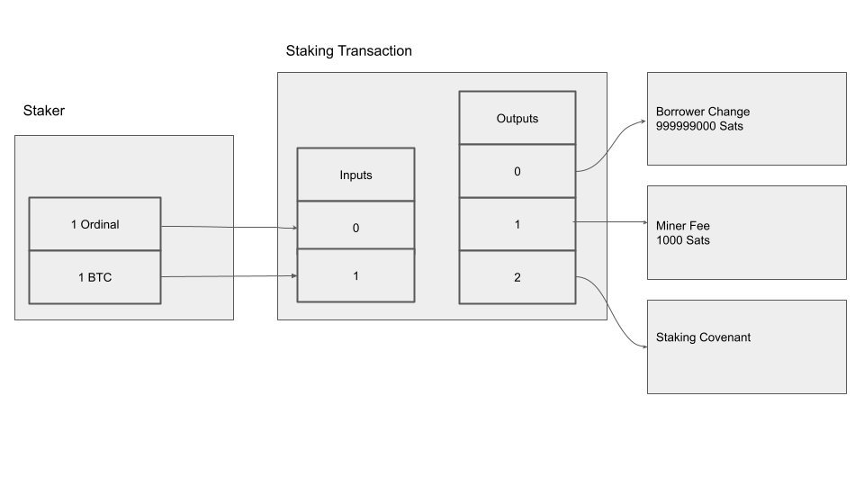

# Use Cases - Ordinal Staking

> Ordinal staking is a new way to earn rewards on Bitcoin. It works by locking up Bitcoin ordinals, which are unique
> satoshis that have been inscribed with data, into a Discreet Log Contract (DLC). The DLC specifies the Ordinal that will
> be staked, the duration of the stake, and the conditions under which the Ordinal will be released. Once the Bitcoin
> ordinal has been locked into the DLC, you can start staking it. The staking pool will then confirm the DLC lock and send
> rewards for you based on the terms of the staking agreement (time, value, etc). When the stake expires, the user may
> redeem the Ordinal from the DLC and receive the rewards that they have earned. Ordinal staking is a new and innovative
> way to earn rewards on Bitcoin. It is a more secure and decentralized way to stake Bitcoin than traditional staking
> methods, and it offers a number of other advantages, such as the ability to stake unique satoshis and to stake Bitcoin
> for specific events or conditions.

## Architecture

### Workflow

1. Alice creates a locking transaction with her Ordinal as input. Bitcoin transaction fees apply.  These are the covenant inputs.
2. The Staking Transaction has the following outputs:
   1. The Ordinal Lock (Staking) Covenant
   2. The miner (transaction) fee
   3. The borrower's change

## Scenario

When combined with the Deep Lake Oracle, the above scenario provides a trust-minimized process for enabling staking protocols as seen on other blockchains, but with the benefit of utilizing only Bitcoin assets and primitives.

### Potential use cases

- Ordinal gating protocols (access controls based on stake)
- Reward-based protocols
- More

## Considerations

### Security

## Try this scenario

> Here we include a link to a graphql collection with some preset values

## Related resources
