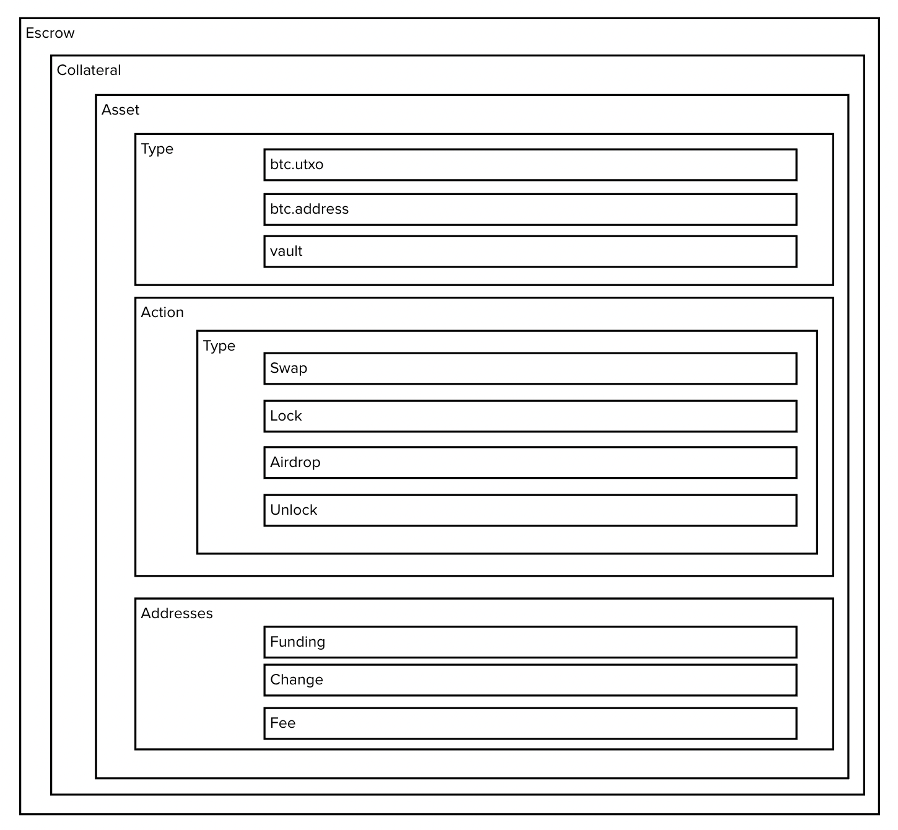

# Understanding API Data Structures

## Escrow

Escrows are the primary containers corresponding to a use case.  They could represent simple Bitcoin locks or more complex multipart transactions that are implemented via chain-of-custody DLC conditional transactions.  Escrows contain one or many Collateral.

## Collateral

Collateral are the primary container for Assets.  

## Asset

Assets are the primary items used for value in transacting on Bitcoin.  Multiple assets are usually combined to make up the collateral for a transaction.  Assets have the following charcteristics:

#### Types

Available asset types are:

  - btc_utxo (satoshis or Ordinals)
    - A utxo id
    - A sequence or vout
    - an amount
  - btc_address
    - a value (the address)
    - 