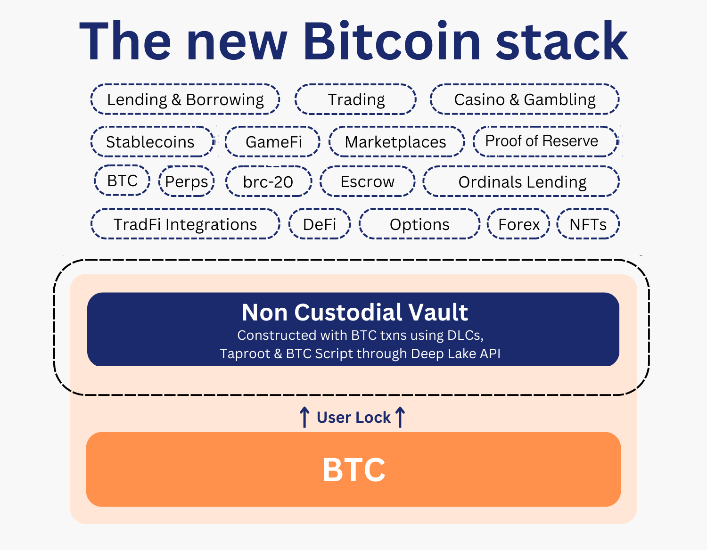

# Introduction

<figure><figcaption></figcaption></figure>

### Welcome To The New Bitcoin Stack

Build DeFi, GameFi, NFT marketplaces & more with a "smart contract" layer on top of Bitcoin—all within minutes & without any bridging, wrapping, or nonsense.

### Abstract

With the rise of smart contract capability and various chains offering myriad functionalities on top of cryptoassets, Bitcoin itself has been forced into wrapping, bridging, and other methods that seemingly enhance the production value of the asset. While these techniques to bring Bitcoin elsewhere are popular, they are very rarely sound nor follow the decentralized, trustless, and peer-to-peer ethos that Bitcoin pioneered.

The helper methods available out of Deep Lake more closely align with the incentives of Bitcoin itself and the properties it has. Through the use of DLCs, Bitcoin is given "smart" capabilities through a series of carefully placed transactions, including Partially Signed Bitcoin Transactions (PSBTs). DLCs are a primary feature of Bitcoin used to accomplish native Bitcoin escrow and more. By utilizing these trustless, decentralized, and non-custodial methods, developers can build Bitcoin escrow, Bitcoin-backed assets, and smart contracts on Bitcoin into any application, use-case, or protocol—decentralized or centralized.
